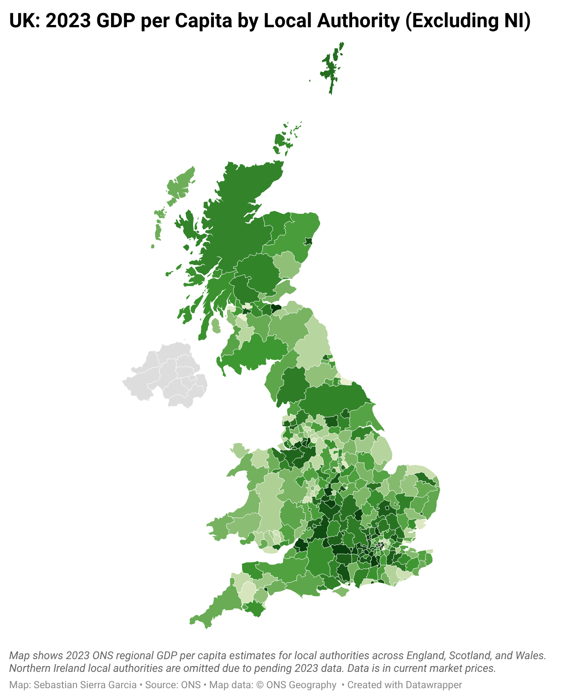
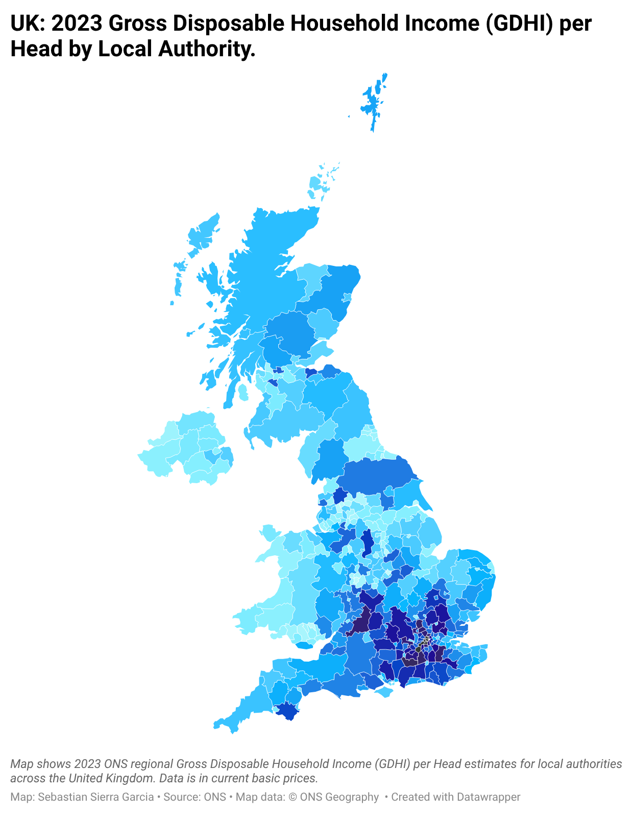

# uk-local-economy
Analysis of Gross Domestic Product per Head, and Gross Disposable Household Income, by UK local Authority

## KEY FINDINGS
to be filled...

**SCATTER:**

**GDP PER CAPITA MAP**

**Interactive version:** [Datawrapper Map](https://www.datawrapper.de/_/aEZjY/?v=2)

**GDHI PER HEAD MAP**

**Interactive version:** [Datawrapper Map](https://www.datawrapper.de/_/zHzHJ/?v=7)

**GDHI-to-GDP RATIO MAP**

**Interactive version:** [Datawrapper Map](https://www.datawrapper.de/_/tVfeD/?v=2)

## HOW TO RUN IT
1. Clone the repository: `git clone https://github.com/sebastiansierra777/uk-local-economy.git`
2. Navigate to the project folder: `cd uk-rental-prices`
3. Recreate the environment from the yml file: `conda evn create -f environment.yml`
4. Download the ONS files following the instructions under the data sources sections. Save the files in `data/raw`
5. Navigate to `notebooks/` folder and run the notebooks inside sequentially

## PROJECT STRUCTURE
* `assets/`: Images for README use only.
* `data/`: Raw and processed datasets.
* `notebooks/`: Jupyter notebooks.
* `output/`: Graphs generated by the notebooks.
* `environment.yml`: Conda environment dependencies.
* `README.md`: Project documentation.

## DATA SOURCES
The data for this analysis was obtained from the UK National Statistical Office: the ONS (Office of National Statistics)

Regional gross disposable household income for local authorities, years 1997 to 2023, can be found here:
* [ONS GDHI for Local Authorities](https://www.ons.gov.uk/economy/regionalaccounts/grossdisposablehouseholdincome/datasets/regionalgrossdisposablehouseholdincomelocalauthorities)

Regional gross domestic product for local authorities, years 1998 to 2023, can be found here:
* [ONS GDP for Local Authorities](https://www.ons.gov.uk/economy/grossdomesticproductgdp/datasets/regionalgrossdomesticproductlocalauthorities)
