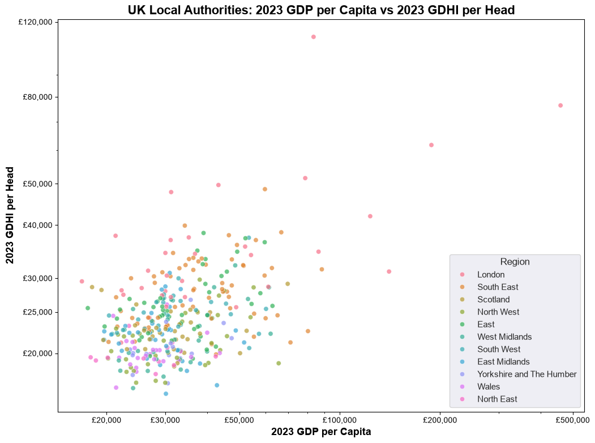
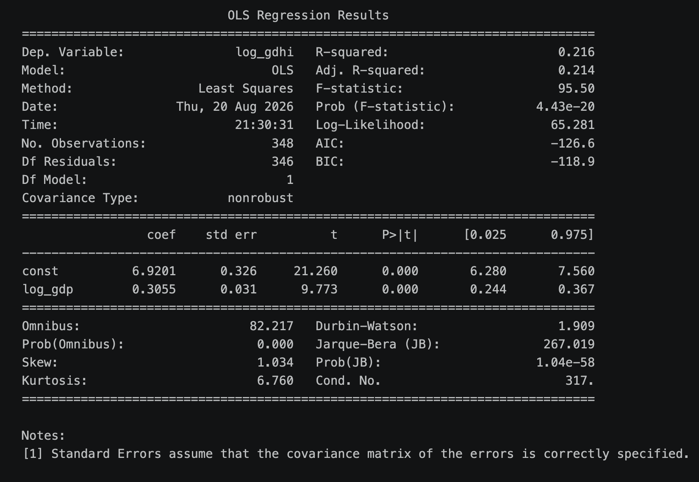
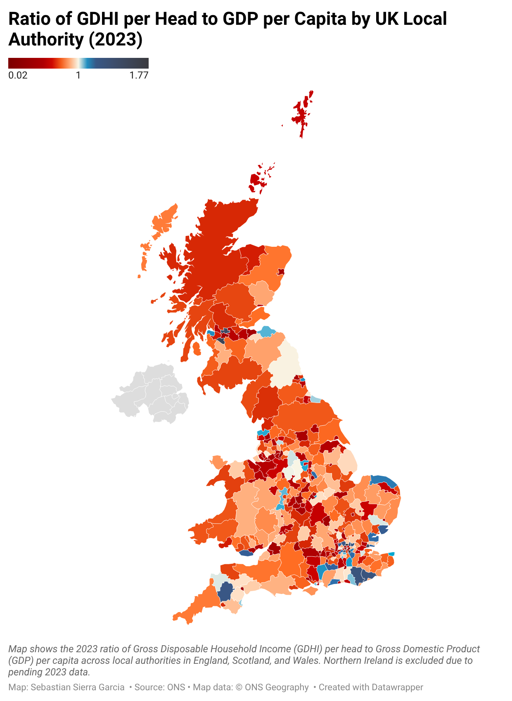

# uk-local-economy
Analysis of Gross Domestic Product (GDP) per Capita, and Gross Disposable Household Income (GDHI) per Head, by UK local Authority

---
## KEY FINDINGS

### Scatter:

---
### Linear Regression Analysis
2023 GDHI per Head by UK Local Authority was regressed on 2023 GDP per Head by UK Local Authority. 

Before calculating the regression, two previous steps were completed: 

1) The local authorities of **City of London**, and **Westminster** were dropped, since their values, especially their GDP per Capita, are very distorted because these two London Boroughs concentrate a lot of economic activity that is disproportionate to their population. 

2) The **GDHI per Head** and **GDP per Capita** values were **log-transformed**. Economic data (and economic geography data in partcular) is often log-transformed before being regressed in order **to fix the behaviour of the residuals of the regression**, and in order **to interpret the coefficients as elasticities**.

> Below is the linear regression log and the corresponding analysis of the coefficients:

**LINEAR REGRESSION LOG:**

1) **The slope is 0.3055**, meaning that **for every 1% increase in GDP per Capita in a UK local authority, a resident of the area takes home 0.3055% of that increase**, in the form of Gross Disposable Household Income (GDHI).

2) **The standard error of the slope is 0.031**, quite low compared to the previously seen coefficient value of 0.3055, indicating that the slope figure is highly precise. 

3) **The t-statistic of the slope is 9.773**. That is to say: 9.773 standard deviations away from zero (the null hypothesis). We can safely reject the null hypothesis and say that GDP per capita does have a mathematical influence on GDHI per head.

4) **The p-value is 0.000**, way lower than the 0.05 threshold. This low p-value tells us that the probability of seing a 9.7 t-statistic for the slope if the relationship between GDP and GDHI did not exist is essentially zero.

5) The 95% confidence interval values tells us that we can say, with 95% confidence, that the true elasticiy of GDHI on GDP across the UK falls between **0.244% and 0.367%.**

6) Our **R-squared value is 0.216**, meaning that **21.6% of the variance in GDHI per Head across the UK can be explained by GDP per Capita**. This number may seem low at first, but we must remember that GDHI per Head is also influenced by other factors such as commuting patterns, zoning laws or housing developments. Factors that we have not captured in this exercise.

**NOTE #1:** **Skewness** and **Kurtosis** are 1.034 and 6.760 respectively, which is typical of economic data. Economic data is almost always skewed to the right, due to income and wealth having a hard floor (£0), but virtually having no ceiling.

**NOTE #2: Omnibus** and **Jarque-Bera** values are indicating that the residuals of the model are not normally distributed. This is to be expected, since this data obviously exhibits spatial autocorrelation. The model needs a residual analysis, and from there, spatial adjustments with spatial weights and other econometric techniques. 

---
### Maps:

Below are links to the Datawrapper maps I made with the data. PNGs of these maps can be found in the `assets/` folder. The ratio map is shown here for exhibition

**GDP PER CAPITA MAP: [Datawrapper Link](https://www.datawrapper.de/_/aEZjY/?v=2)**

**GDHI PER HEAD MAP: [Datawrapper Link](https://www.datawrapper.de/_/zHzHJ/?v=7)**

**GDHI-to-GDP RATIO MAP**

**Interactive version:** [Datawrapper Map](https://www.datawrapper.de/_/tVfeD/?v=2)

---
## HOW TO RUN IT
0. Navigate to the directory where you want to store the project folder (e.g., your Documents or Desktop folder): `cd ~/Documents`
1. Clone the repository: `git clone https://github.com/sebastiansierra777/uk-local-economy.git`
2. Navigate to the project folder: `cd uk-local_economy`
3. Recreate the environment from the yml file: `conda evn create -f environment.yml`
4. Activate the environment: `conda activate uk_local_economy`
4. Download the ONS files following the instructions under the data sources section. Save the files in `data/raw`
5. Navigate to `notebooks/` folder and run the notebooks inside sequentially.

## PROJECT STRUCTURE
* `assets/`: Images for README use only.
* `data/`: Raw and processed datasets.
* `notebooks/`: Jupyter notebooks.
* `output/`: Graphs generated by the notebooks.
* `environment.yml`: Conda environment dependencies.
* `README.md`: Project documentation.

## DATA SOURCES
The data for this analysis was obtained from the UK National Statistical Office: the ONS (Office of National Statistics)

Regional gross disposable household income for local authorities, years 1997 to 2023, can be found here:
* [ONS GDHI for Local Authorities](https://www.ons.gov.uk/economy/regionalaccounts/grossdisposablehouseholdincome/datasets/regionalgrossdisposablehouseholdincomelocalauthorities)

Regional gross domestic product for local authorities, years 1998 to 2023, can be found here:
* [ONS GDP for Local Authorities](https://www.ons.gov.uk/economy/grossdomesticproductgdp/datasets/regionalgrossdomesticproductlocalauthorities)
